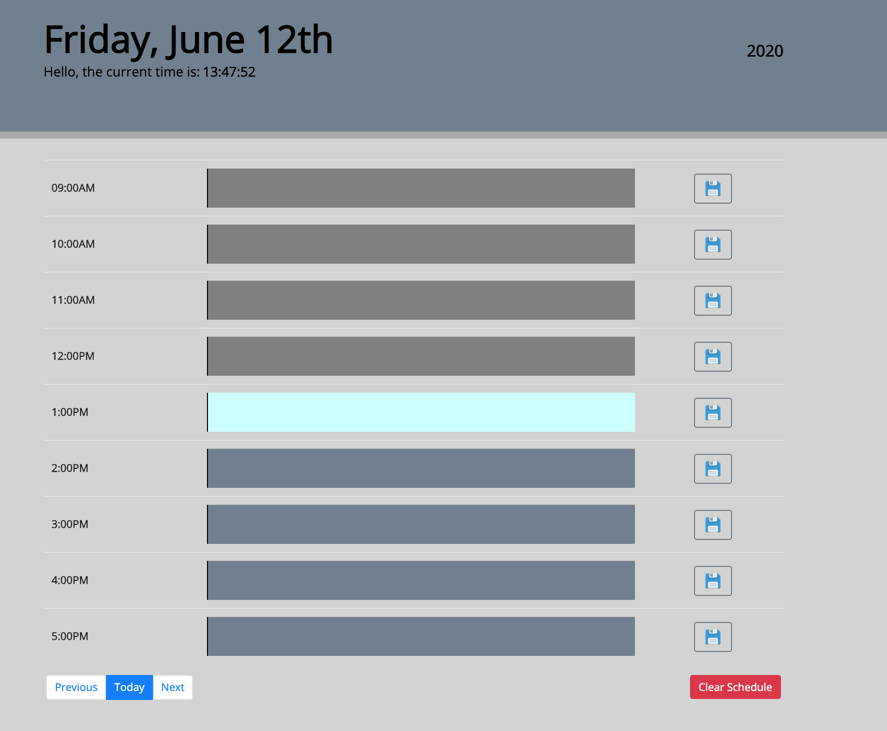

# WorkDayScheduler
The Work Day Scheduler is designed to let you save important events to keep more organized. This schedule ranges from 9AM to 5PM and a light blue row indicates current time. The dark grey rows indicate past events, and the slate grey indicate future events. 

Sheduler includes:

Previous button for a schedule for previous day

Today button for current past, current events, and future events for that day depending on time

Next button for the following day's schedule

Clear button to delete content previously saved 

